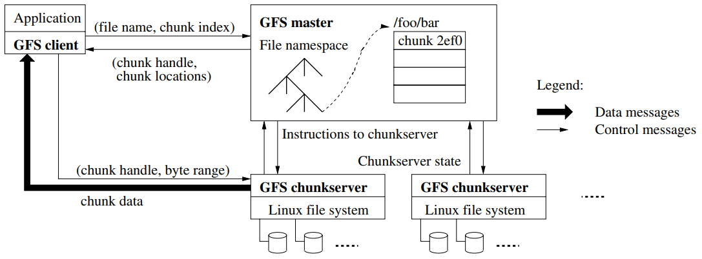

# minidfs

<div align="center">
  minidfs is a tiny distributed file system inspired by Google's GFS. It currently uses HTTP for communication, is written in Go, and has less than 700 lines of code, making it a lightweight and easy-to-understand implementation of a distributed file system.
  <br>
  <br>
  It should be noted that it is not production ready and lacks certain features such as replication, fault tolerance and retries, which are essential for a robust distributed system.
  <br>
  <br>
  
</div>

The system consists of three components: master, chunkserver and client. The master is responsible for managing all file metadata and monitoring the state of all chunkserver instances. The chunkserver instances store fixed sized chunks of the files. For each chunk the master stores on which chunkserver it is stored and where its replicas are. The client can read and write data to the system. The process for reading and writing files is explained in the sections below.

## Write


1. client opens the file locally
2. cilent creates a `UploadInitRequest` containing the filename and filesize and sends it to the master server
3. the master server calculates the required number of chunks and defines, which chunk to store on which chunkserver
4. the created `UploadInitResponse` is sent back to the client
5. the client splits the file into chunks according to the masters response
6. each chunk is directly uploaded to a chunkserver instance as defined in the `UploadInitResponse`
7. once a chunk is successfully uploaded to a chunkserver, the chunkserver reports success for the chunk to the master
8. as soon as all chunks are uploaded, the write process is completed for the client and the file is downloadable
9. todo: automatic replication initiated by the master

## Read


1. client requests the locations of all chunks from the master server
2. client requests each chunk from the received locations
3. client writes all chunks into a file in correct order

## Example usage
```bash
# build minidfs
> make build
# start the master instance on port 8000 using a chunksize of 1MB
> ./minidfs master --port 8000 --chunkSize 1000000
# start two chunkserver insatnces on port 8001/8002 each using its own storage location
# usually they would run on different machines
> mkdir data1 data2
> ./minidfs chunkserver --master http://localhost:8000/ --port 8001 --dir ./data1
> ./minidfs chunkserver --master http://localhost:8000/ --port 8002 --dir ./data2

# create a file with random bytes of about 32MB
> head -c 32750109 /dev/urandom > input.txt
# upload the file to the cluster
> ./minidfs client --master http://localhost:8000/ --action write --filename input.txt
# download the file
> ./minidfs client --master http://localhost:8000/ --action read --filename input.txt --output-filename output.txt
# compare the input file to the downloaded output file
> diff input.txt output.txt
# -> no differences are found
```

With the chunk size of 1MB, the file will be split into 33 parts. Currently each chunk is stored on a random available chunkserver. You can see which chunk was stored on which server if you take a look into the two data directories. 

```bash
> cd data1 && stat -c "%n,%s" * | column -t -s,
0e5523056ab6dbb2a3bfa672b305d76b003954fa5a1bcc8de29528c2ad79b2ed_0   1000000
0e5523056ab6dbb2a3bfa672b305d76b003954fa5a1bcc8de29528c2ad79b2ed_1   1000000
0e5523056ab6dbb2a3bfa672b305d76b003954fa5a1bcc8de29528c2ad79b2ed_10  1000000
0e5523056ab6dbb2a3bfa672b305d76b003954fa5a1bcc8de29528c2ad79b2ed_11  1000000
0e5523056ab6dbb2a3bfa672b305d76b003954fa5a1bcc8de29528c2ad79b2ed_12  1000000
0e5523056ab6dbb2a3bfa672b305d76b003954fa5a1bcc8de29528c2ad79b2ed_14  1000000
0e5523056ab6dbb2a3bfa672b305d76b003954fa5a1bcc8de29528c2ad79b2ed_18  1000000
0e5523056ab6dbb2a3bfa672b305d76b003954fa5a1bcc8de29528c2ad79b2ed_20  1000000
0e5523056ab6dbb2a3bfa672b305d76b003954fa5a1bcc8de29528c2ad79b2ed_23  1000000
0e5523056ab6dbb2a3bfa672b305d76b003954fa5a1bcc8de29528c2ad79b2ed_3   1000000
0e5523056ab6dbb2a3bfa672b305d76b003954fa5a1bcc8de29528c2ad79b2ed_30  1000000
0e5523056ab6dbb2a3bfa672b305d76b003954fa5a1bcc8de29528c2ad79b2ed_31  1000000
0e5523056ab6dbb2a3bfa672b305d76b003954fa5a1bcc8de29528c2ad79b2ed_4   1000000
0e5523056ab6dbb2a3bfa672b305d76b003954fa5a1bcc8de29528c2ad79b2ed_5   1000000
0e5523056ab6dbb2a3bfa672b305d76b003954fa5a1bcc8de29528c2ad79b2ed_6   1000000
0e5523056ab6dbb2a3bfa672b305d76b003954fa5a1bcc8de29528c2ad79b2ed_8   1000000
0e5523056ab6dbb2a3bfa672b305d76b003954fa5a1bcc8de29528c2ad79b2ed_9   1000000

> cd ../data2 && stat -c "%n,%s" * | column -t -s,
0e5523056ab6dbb2a3bfa672b305d76b003954fa5a1bcc8de29528c2ad79b2ed_13  1000000
0e5523056ab6dbb2a3bfa672b305d76b003954fa5a1bcc8de29528c2ad79b2ed_15  1000000
0e5523056ab6dbb2a3bfa672b305d76b003954fa5a1bcc8de29528c2ad79b2ed_16  1000000
0e5523056ab6dbb2a3bfa672b305d76b003954fa5a1bcc8de29528c2ad79b2ed_17  1000000
0e5523056ab6dbb2a3bfa672b305d76b003954fa5a1bcc8de29528c2ad79b2ed_19  1000000
0e5523056ab6dbb2a3bfa672b305d76b003954fa5a1bcc8de29528c2ad79b2ed_2   1000000
0e5523056ab6dbb2a3bfa672b305d76b003954fa5a1bcc8de29528c2ad79b2ed_21  1000000
0e5523056ab6dbb2a3bfa672b305d76b003954fa5a1bcc8de29528c2ad79b2ed_22  1000000
0e5523056ab6dbb2a3bfa672b305d76b003954fa5a1bcc8de29528c2ad79b2ed_24  1000000
0e5523056ab6dbb2a3bfa672b305d76b003954fa5a1bcc8de29528c2ad79b2ed_25  1000000
0e5523056ab6dbb2a3bfa672b305d76b003954fa5a1bcc8de29528c2ad79b2ed_26  1000000
0e5523056ab6dbb2a3bfa672b305d76b003954fa5a1bcc8de29528c2ad79b2ed_27  1000000
0e5523056ab6dbb2a3bfa672b305d76b003954fa5a1bcc8de29528c2ad79b2ed_28  1000000
0e5523056ab6dbb2a3bfa672b305d76b003954fa5a1bcc8de29528c2ad79b2ed_29  1000000
0e5523056ab6dbb2a3bfa672b305d76b003954fa5a1bcc8de29528c2ad79b2ed_32  750109
0e5523056ab6dbb2a3bfa672b305d76b003954fa5a1bcc8de29528c2ad79b2ed_7   1000000
```

As the file is a bit smaller than 33MB, the last chunk only stores about 750kB.